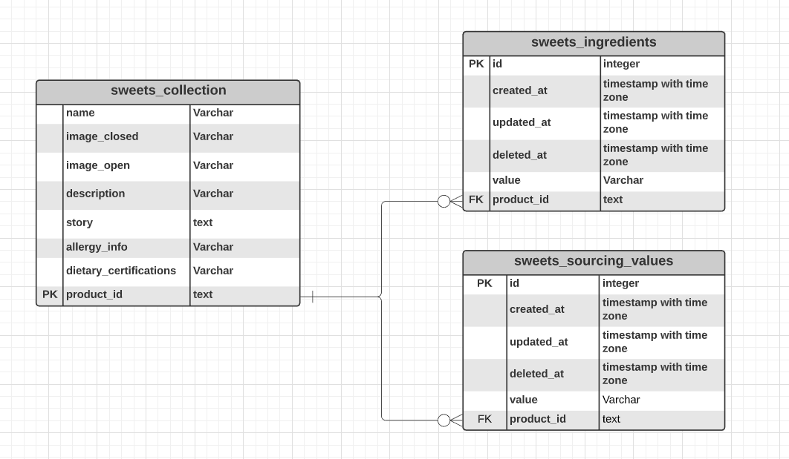

# Sweets API

[](https://golang.org/)

Sweets API is a microservice capable of handling CRUD operations via REST API. The purpose of this project is to demonstrate how to structurize Golang application using modular programming and SOLID principles.

### Tech

Sweets API uses a number of open source projects to work properly:

* [Golang](https://golang.org/) - Go is an open source programming language that makes it easy to build simple, reliable, and efficient software.
* [GORM](https://gorm.io/) - The fantastic ORM library for Golang
* [gorilla/mux](https://github.com/gorilla/mux) - Package mux implements a request router and dispatcher.
* [PostgreSQL](https://www.postgresql.org/) - The World's Most Advanced Open Source Relational Database
* [Docker](https://www.docker.com/) - Securely build, share and run modern applications anywhere

### Installation

Sweets API requires [Docker](https://www.docker.com/) and [docker-compose](https://docs.docker.com/compose/) to run.

Install Docker and docker-compose to start the server
 - [Docker Desktop on Windows](https://docs.docker.com/docker-for-windows/install/)
 - [Docker on Linux](https://docs.docker.com/install/linux/docker-ce/centos/)
 - [Docker Desktop on MacOS](https://docs.docker.com/docker-for-mac/install/)
 - [Install docker-compose](https://docs.docker.com/compose/install/)

```sh
$ cd sweets-api
$ docker-compose up
```

### Usage
    - GET "https://{HOST}:9988/api/sweets"
    - GET "https://{HOST}:9988/api/sweets/{productId}"
    - POST "https://{HOST}:9988/api/sweets"
    - PUT "https://{HOST}:9988/api/sweets/{productId}"
    - DELETE "https://{HOST}:9988/api/sweets/{productId}"

### ERD


### Todos

 - Write MORE Tests

